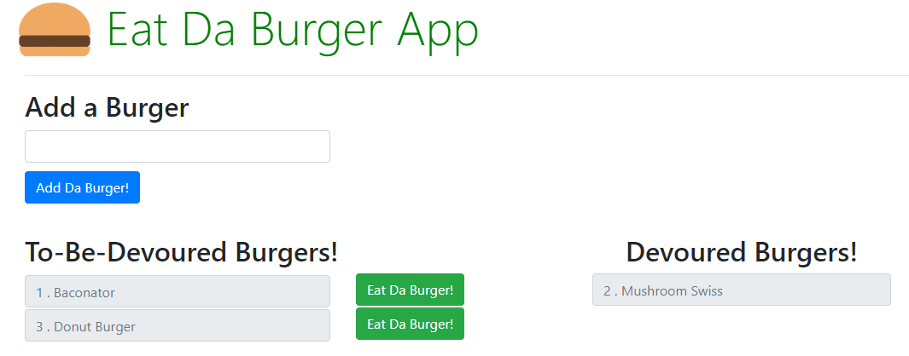

# burger

### Overview
Eat Da Burger is a project that applies MySQL, Node, Express, Handlebars, a homemade ORM and the MVC design pattern.

User can "create" burgers by entering the name of a burger and clicking the "Add Da Burger!" button. This creates an entry in the MySQL database and the burger is displayed in the "To-Be-Devoured Burgers!" column. Users can then "devour" a burger by clicking the corresponding "Eat Da Burger!" button. This changes the status of the specific burger in the database and it is moved to the "Devoured Burgers!" column.

### Setup
1. Clone the repo.
2. Set up MySQL database using schema.sql and seeds.sql in the db directory.
2. In Terminal/Bash window, enter "npm install".
3. In Terminal/Bash, in the app's root directory, enter "node server.js".
4. In browser, navigate to http://localhost8080.

### Screen Shots

Screen shot showing the app when first opened (it is a Single-Page App):

## Author
Philip Hu